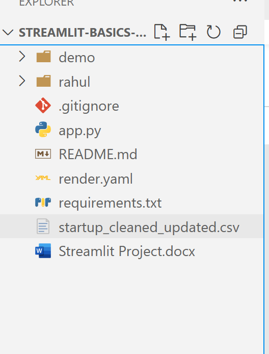

# 🚀 Indian Startup Funding Analysis

This Streamlit web app analyzes Indian startup funding trends using interactive visualizations. It provides insights from both startup and investor perspectives.

---

## 📊 Features

- ✅ **Overall Analysis:** Total funding, MoM trends, top cities/sectors/rounds
- ✅ **Startup POV:** Funding rounds, investors, timeline
- ✅ **Investor POV:** Recent investments, sectors, YoY graph
- ✅ **Top Startups:** Year-wise highest funded startups
- ✅ **Funding Heatmap:** Visualizes funding activity over time

---


### 📊 Project Structure



---

## 🖥️ Demo

🌐 Hosted on: [https://your-render-url.onrender.com](#)  
*(Replace this with your actual URL)*


## 🖼️ Demo Screenshots

### 📊 Dashboard Overview


### Overview Part 2


### 🔥 Startup Funding


### 💰 Startup Information


### 💰 Top Funded Startup YOY


---

---

## 🚀 How to Run the Project Locally

1. **Clone the repository**
   ```bash
   git clone https://github.com/Singhrahul2511/Indian_Startup_Analysis.git
   cd Indian_Startup_Analysis

2. **Create a virtual environment**
    python -m venv venv
    venv\\Scripts\\activate   # For Windows
    source venv/bin/activate  # For Linux/Mac

3. **Install dependencies**
    pip install -r requirements.txt

4. **Run the Streamlit app**
    streamlit run app.py

5. **Open your browser**
    App will run at http://localhost:8501

6. **🌐 Live Demo**
    You can also check the live version here:
    🔗 https://indian-startup-analysis-57rq.onrender.com/
