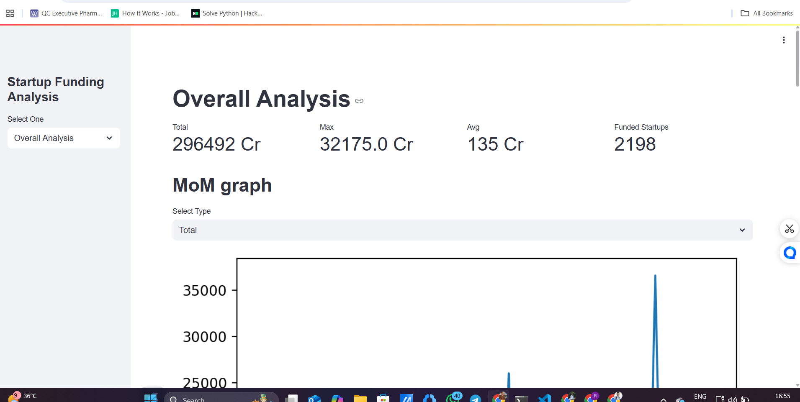
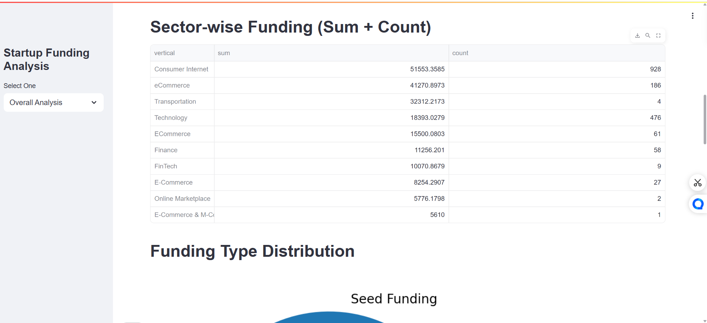
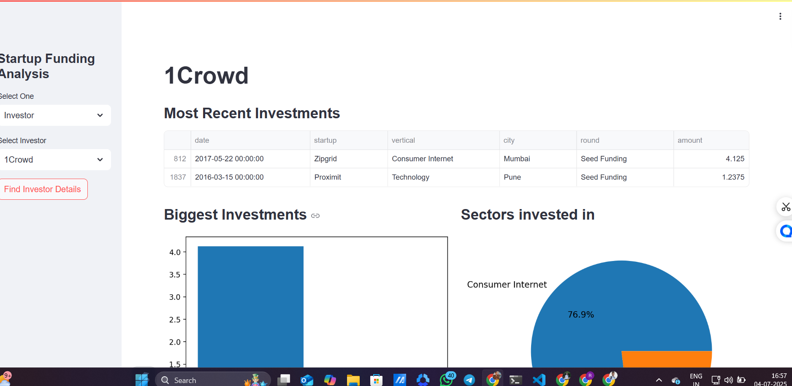
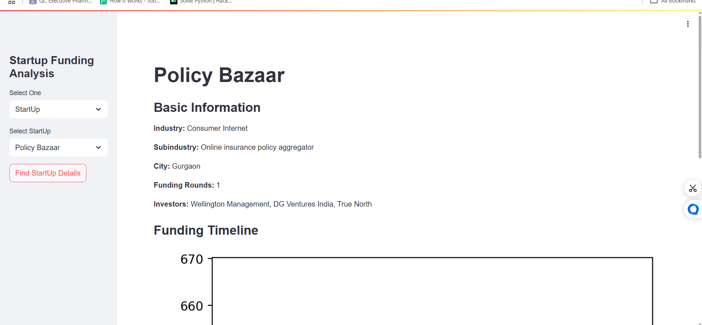
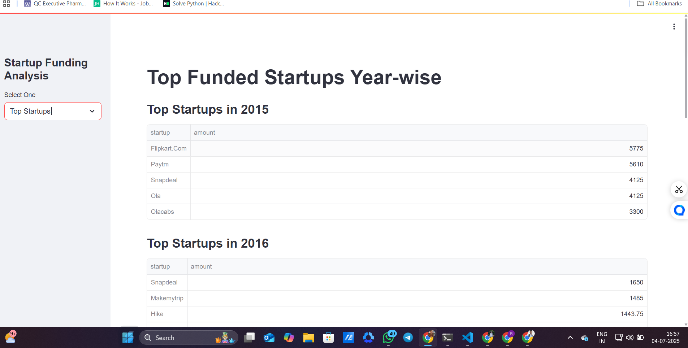

# 🚀 Indian Startup Funding Analysis

This Streamlit web app analyzes Indian startup funding trends using interactive visualizations. It provides insights from both startup and investor perspectives.

---

## 📊 Features

- ✅ **Overall Analysis:** Total funding, MoM trends, top cities/sectors/rounds
- ✅ **Startup POV:** Funding rounds, investors, timeline
- ✅ **Investor POV:** Recent investments, sectors, YoY graph
- ✅ **Top Startups:** Year-wise highest funded startups
- ✅ **Funding Heatmap:** Visualizes funding activity over time

---

<pre> ```bash 📦 Indian_Startup_Analysis/ ├── app.py # Streamlit app ├── startup_cleaned_updated.csv # Cleaned dataset ├── requirements.txt # Required packages ├── render.yaml # Render deployment config ├── README.md # Project overview └── demo/ # Screenshots for README ├── overview.png ├── overview2.png ├── startup_funding.png ├── startup_info.png └── top_funded_startup.png ``` </pre>

---

## 🖥️ Demo

🌐 Hosted on: [https://your-render-url.onrender.com](#)  
*(Replace this with your actual URL)*


## 🖼️ Demo Screenshots

### 📊 Dashboard Overview


### Overview Part 2


### 🔥 Startup Funding


### 💰 Startup Information


### 💰 Top Funded Startup YOY



---

## 📦 Installation

```bash
git clone https://github.com/Singhrahul2511/Indian_Startup_Analysis.git
cd Indian_Startup_Analysis
pip install -r requirements.txt
streamlit run app.py


🛠️ Built With
Streamlit
Pandas
Matplotlib
Seaborn

📈 Dataset
Used from open-source startup funding data (manually cleaned and normalized).

👨‍💻 Author
Rahul Kumar
🔗 LinkedIn
📧 aiwithrahul25@gmail.com
🎥 YouTube: AI with Rahul


---


```markdown

